# AWS Lambda Log Batch Processor Architecture

## Architecture Diagram

```mermaid
graph TD
    A[📁 Log Files] -->|Upload| B[🪣 S3 Bucket<br/>input-logs]
    B -->|S3 Event Trigger| C[⚡ Lambda 1<br/>LogSplitterLambda]
    C -->|Read File| B
    C -->|Split & Send Messages| D[📬 SQS Queue<br/>log-processing-queue]
    D -->|SQS Event Trigger| E[⚡ Lambda 2<br/>LogProcessorWorker]
    E -->|Store Processed Data| F[🗄️ DynamoDB<br/>ProcessedLogsTable]
    E -->|Error Messages| G[💀 Dead Letter Queue<br/>DLQ]

    subgraph "AWS Services"
        B
        C
        D
        E
        F
        G
    end

    %% subgraph "Data Flow"
    %%     I[1. File Upload] --> J[2. Split Processing]
    %%     J --> K[3. Queue Messages]
    %%     K --> L[4. Process Individual Lines]
    %%     L --> M[5. Store Results]
    %% end

    style A fill:#e1f5fe
    style B fill:#bbdefb
    style C fill:#ffecb3
    style D fill:#c8e6c9
    style E fill:#ffecb3
    style F fill:#f8bbd9
    style G fill:#ffcdd2
```

## Component Details

### 🪣 S3 Buckets
- **input-logs**: Receives log files that trigger the processing pipeline

### ⚡ Lambda Functions
- **LogSplitterLambda**: Reads large files and splits them line-by-line into SQS messages
- **LogProcessorWorker**: Processes individual log lines and stores results in DynamoDB

### 📬 Message Queue
- **SQS Queue**: Decouples file processing from individual line processing
- **Dead Letter Queue**: Handles failed message processing for resilience

### 🗄️ Database
- **DynamoDB**: Stores processed log entries with metadata and batch tracking

## Data Flow Sequence

## Key Architectural Benefits

1. **Scalability**: SQS allows independent scaling of file splitting and line processing
2. **Resilience**: Dead Letter Queue handles processing failures
3. **Decoupling**: Each component has a single responsibility
4. **Cost Efficiency**: Pay-per-use Lambda execution model
5. **Monitoring**: Built-in CloudWatch integration for all services